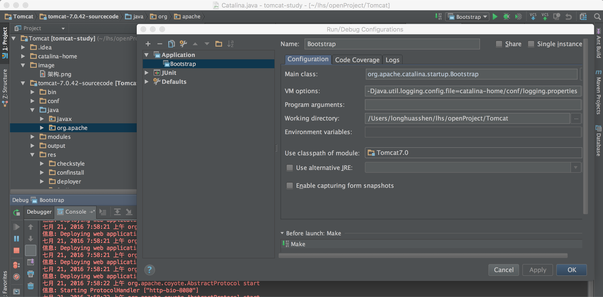
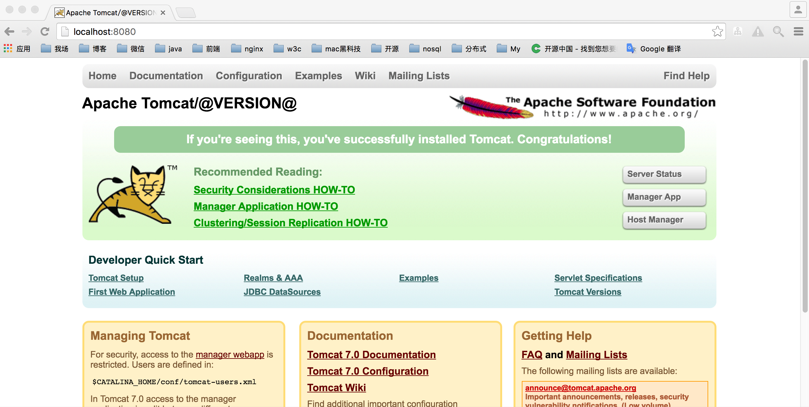

Tomcat
======

Tomcat 7.0.42 源代码中文注释

运行方法：下载本项目源码，导入到idea中，如下配置一个启动程序，即可进行调试

| 包名        |   用途           |
| ------------- |:-------------:|
| javax      | servlet/jsp/el相关的api|
| org.apache.catalina      | tomcat自身架构|
| org.apache.coyote | http、ajp协议实现相关的类  |    
| org.apache.el | 实现el规范  |    
| org.apache.jasper	|实现jsp规范、编译jsp文件|
| org.apache.juli |	tomcat的日志系统    |
| org.apache.naming |	jndi实现   |
| org.apache.tomcat| tomcat的工具包、net、digester xml解析器       |

